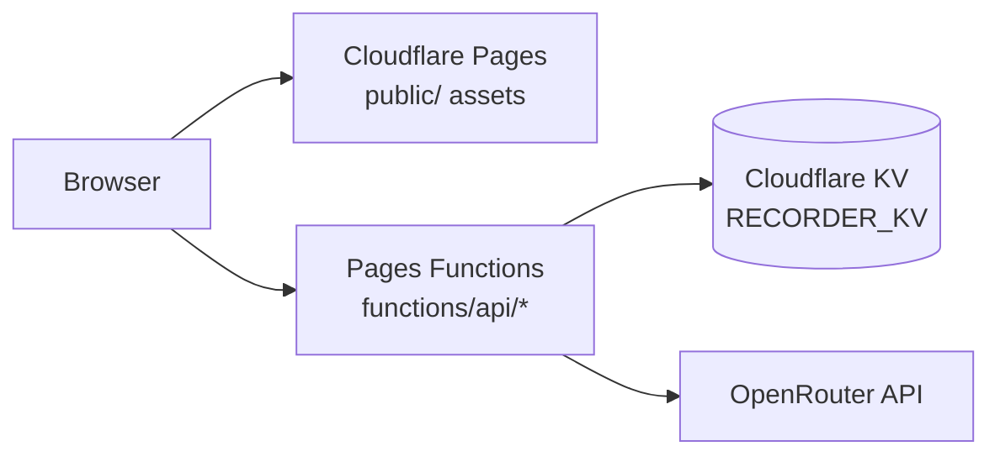

# Cloudflare Deployment

Project Recorder can run on Cloudflare Pages with Pages Functions. Static files are served from `public/`, and the `/api/*` backend is implemented in `functions/`.

## Architecture



## Required Cloudflare Resources

- Cloudflare Pages project.
- Pages Functions enabled through the `functions/` directory.
- KV namespace bound to the Pages project as `RECORDER_KV`.
- Optional secret variable `OPENROUTER_API_KEY`.

`OPENROUTER_API_KEY` can be omitted if you want a pure BYOK deployment where each user supplies their own key in the frontend Settings dialog.

## Environment Variables

| Name | Required | Secret | Description |
| --- | --- | --- | --- |
| `OPENROUTER_API_KEY` | No for BYOK-only | Yes | Server-funded OpenRouter API key. |
| `OPENROUTER_API_URL` | No | No | Defaults to `https://openrouter.ai/api/v1`. |
| `STT_MODEL` | No | No | Audio-capable OpenRouter model for transcription. |
| `MODELS_JSON` | No | No | JSON array of chat model picker entries. |
| `RECORDER_KV` | Yes | Binding | KV namespace used for `workspace.md`. |

Note: `OPENROUTER_API_KEY` is required for server-funded usage, but optional for BYOK-only usage.

Example `MODELS_JSON`:

```json
[
  { "id": "deepseek/deepseek-v3.2", "label": "DeepSeek V3.2" },
  { "id": "minimax/minimax-m2.7", "label": "MiniMax M2.7" },
  { "id": "x-ai/grok-4.1-fast", "label": "Grok 4.1 Fast" }
]
```

## Local Cloudflare Dev

```bash
npm install
cp .dev.vars.example .dev.vars
# Edit .dev.vars and set OPENROUTER_API_KEY.
npm run cf:dev
```

The `cf:dev` script starts Pages Functions with a local KV binding:

```bash
npx wrangler pages dev public --kv=RECORDER_KV
```

Open the local URL printed by Wrangler, usually `http://localhost:8788`.

## Production Deploy

1. Create a Pages project connected to this repository.
2. Set the build output directory to `public`.
3. Leave the build command empty unless your Pages project requires one.
4. Add the `OPENROUTER_API_KEY` secret.
5. Add optional variables from `wrangler.toml` if you want to override defaults.
6. Create and bind a KV namespace as `RECORDER_KV`.
7. Deploy the Pages project.

For BYOK-only deployments, skip step 4 and tell users to open **Settings** in the app and save their own OpenRouter key locally.

CLI deploy:

```bash
npm run cf:deploy
```

KV creation helper:

```bash
npm run cf:kv:create
```

After creating the namespace, bind it to the Pages project in Cloudflare. `wrangler.toml` intentionally does not include a placeholder KV namespace ID because a fake ID can break deploys.

## API Route Mapping

| Route | Cloudflare file | Storage/API used |
| --- | --- | --- |
| `GET /api/config` | `functions/api/config.js` | Environment variables. |
| `GET /api/health` | `functions/api/health.js` | OpenRouter `/key`, KV binding check. |
| `GET /api/workspace` | `functions/api/workspace.js` | KV `workspace.md`. |
| `POST /api/workspace` | `functions/api/workspace.js` | KV `workspace.md`. |
| `POST /api/transcribe` | `functions/api/transcribe.js` | OpenRouter `chat/completions`. |
| `POST /api/chat` | `functions/api/chat.js` | OpenRouter streaming `chat/completions`. |

## Compatibility Notes

- The Cloudflare backend does not use Express, Multer, Node `fs`, or local temp files.
- Audio uploads are parsed with `request.formData()` and encoded in-memory before being sent to OpenRouter.
- Workspace persistence requires KV. Without `RECORDER_KV`, reads return the default workspace and writes return an error.
- Browser microphone capture still requires a secure context. Cloudflare Pages provides HTTPS in production.
- Large audio files are constrained by Cloudflare request/body/runtime limits and OpenRouter model limits. For very large audio workflows, move uploads through R2 before transcription.

## Verification Checklist

- `GET /api/config` returns model entries and no API key.
- `GET /api/health` returns `openrouter: true`, `stt: true`, and `storage: "kv"`.
- Without a server secret, saving a valid key in **Settings** makes `GET /api/health` return `byok: true`.
- Editing the workspace shows `auto-save` instead of `save failed`.
- Refreshing the page reloads the saved workspace from KV.
- Uploading or recording audio appends a `# Transcription` section.
- LLM chat streams and appends the final Markdown response.

## References

- Cloudflare Pages Functions: https://developers.cloudflare.com/pages/functions/
- Pages Functions Wrangler configuration: https://developers.cloudflare.com/pages/functions/wrangler-configuration/
- Workers KV bindings: https://developers.cloudflare.com/kv/concepts/kv-bindings/
- Workers Request `formData()`: https://developers.cloudflare.com/workers/runtime-apis/request/#formdata
- OpenRouter current API key endpoint: https://openrouter.ai/docs/api/api-reference/api-keys/get-current-key
