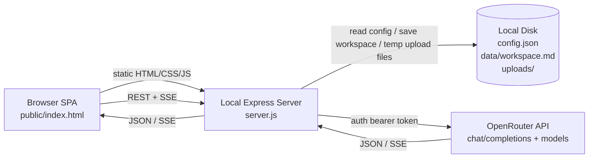

# Project Recorder Technical Specification

Generated from repository analysis on 2026-06-26.

## 1. Product Definition

Project Recorder is a local, single-page speech-to-text workspace. It lets a user capture audio from a microphone or upload an audio file, transcribe that audio through an OpenRouter audio-capable model, edit the resulting Markdown workspace, and ask an LLM to post-process the workspace in a side-by-side chat panel.

### Current implemented capabilities

- Upload an audio file and submit it for transcription.
- Record microphone audio in the browser, transcribe it after the user stops recording, and append the result to the workspace.
- Edit a Markdown workspace in a syntax-highlighted editor.
- Auto-save the workspace to disk with a debounce.
- Export the workspace as a `.md` file from the browser.
- Send the full workspace and a user request to an OpenRouter chat model.
- Stream LLM output back into the chat UI and append the final LLM output to the workspace.
- Keep server-owned API secrets on the backend only.
- Allow BYOK usage by storing a user-provided OpenRouter key in browser local storage and sending it to the backend only for OpenRouter calls.

### Current non-goals

- Multi-user collaboration.
- User accounts, authentication, authorization, or cloud sync.
- Multiple workspaces or project files.
- Realtime microphone transcription. The UI shows a realtime recording timer/waveform, but actual transcription happens after stop.
- Database-backed persistence.
- Production build tooling.

### Important implementation note

The current codebase uses OpenRouter for both STT and LLM chat. `docs/prd.md` and `CLAUDE.md` still describe a Volcengine ASR design with file ASR, streaming ASR, WebSockets, and Volcengine credentials. Those modules and routes are not present in the implementation. This specification documents the product as implemented and calls out deltas where relevant.

## 2. Repository Map

| Path | Purpose |
| --- | --- |
| `server.js` | Node/Express server, configuration loading, static hosting, workspace persistence, transcription endpoint, chat SSE proxy. |
| `lib/openrouter.js` | OpenRouter client functions for audio transcription, streaming chat, and credential validation. |
| `functions/` | Cloudflare Pages Functions implementation of the same `/api/*` backend routes. |
| `public/index.html` | Entire frontend SPA: React components, CSS, Markdown highlighting, recording, upload, chat, auto-save, export. |
| `config.example.json` | Template for local `config.json`. |
| `.dev.vars.example` | Template for local Wrangler/Cloudflare environment variables. |
| `wrangler.toml` | Cloudflare Pages/Functions configuration. |
| `README.md` | Current setup and high-level implementation notes. |
| `docs/deployment/cloudflare.md` | Cloudflare deployment guide. |
| `docs/prd.md` | Older PRD describing intended Volcengine architecture; partially stale against implementation. |
| `docs/design/Project Recorder.html` | Design prototype matching the implemented single-page UI. |
| `.gitignore` | Excludes `node_modules/`, `uploads/`, `config.json`, and `data/workspace.md`. |

## 3. System Architecture



### Architectural style

- Local-first web application served by a lightweight Node backend.
- Cloudflare Pages deployment served by static assets plus Pages Functions.
- Single frontend document with no build step.
- Backend-for-frontend pattern: browser never talks to OpenRouter directly.
- File-system persistence for local Node; KV persistence for Cloudflare.
- OpenAI-compatible chat-completions API for both transcription and chat.

### Process model

- One Node.js process starts from `server.js`.
- Express serves `public/` statically and exposes `/api/*` endpoints.
- Browser state lives in React memory for the session.
- Workspace state is copied to `data/workspace.md` via debounced POSTs.
- Chat history is not persisted.

## 4. Technology Stack

### Backend

- Runtime: Node.js with CommonJS modules.
- HTTP framework: `express`.
- Upload parser: `multer`.
- HTTP server: Node built-in `http`.
- File I/O: Node built-in `fs` and `path`.
- External API calls: native `fetch`.

### Frontend

- React: `react@18.3.1` via UMD CDN.
- React DOM: `react-dom@18.3.1` via UMD CDN.
- JSX transform: `@babel/standalone@7.29.0` in the browser.
- Fonts: Google Fonts (`JetBrains Mono`, `Inter`).
- Browser APIs:
  - `fetch`
  - `ReadableStream.getReader`
  - `navigator.mediaDevices.enumerateDevices`
  - `navigator.mediaDevices.getUserMedia`
  - `MediaRecorder`
  - `AudioContext`
  - `Blob`
  - `URL.createObjectURL`

### Package dependencies

Declared in `package.json`:

| Package | Declared version | Lockfile version | Used? | Notes |
| --- | --- | --- | --- | --- |
| `express` | `^4.21.0` | `4.22.1` | Yes | Server, routes, static hosting, body parsing. |
| `multer` | `^1.4.5-lts.1` | `1.4.5-lts.2` | Yes | Multipart audio upload handling. |
| `uuid` | `^10.0.0` | `10.0.0` | No | Stale dependency from prior Volcengine design. |
| `ws` | `^8.18.0` | `8.20.0` | No | Stale dependency from prior streaming-ASR design. |

## 5. Configuration

### Source

The local Node backend reads `config.json` from the repository root at startup. If the file is missing, the server logs an error and exits. The Cloudflare Pages Functions backend reads equivalent values from environment variables and secrets. In both runtimes, a frontend BYOK key sent as `X-OpenRouter-Api-Key` takes precedence over the server-configured key for that request.

### Template

`config.example.json`:

```json
{
  "openrouter": {
    "apiKey": "",
    "apiUrl": "https://openrouter.ai/api/v1"
  },
  "sttModel": "xiaomi/mimo-v2-omni",
  "models": [
    { "id": "deepseek/deepseek-v3.2", "label": "DeepSeek V3.2" },
    { "id": "minimax/minimax-m2.7", "label": "MiniMax M2.7" },
    { "id": "x-ai/grok-4.1-fast", "label": "Grok 4.1 Fast" }
  ]
}
```

### Fields

| Field | Type | Required | Used by | Description |
| --- | --- | --- | --- | --- |
| `openrouter.apiKey` | string | Yes | Backend | Bearer token for OpenRouter API calls. |
| `openrouter.apiUrl` | string | Yes | Backend | Base URL, usually `https://openrouter.ai/api/v1`. |
| `sttModel` | string | No | Backend | Model ID for audio transcription; server fallback is `openrouter/auto`. |
| `models` | array | No | Frontend + backend | Chat model list displayed in the model picker. Each entry has `id` and `label`. |

### Environment variables

| Variable | Default | Purpose |
| --- | --- | --- |
| `PORT` | `3000` | HTTP port for local server. |
| `OPENROUTER_API_KEY` | none | Cloudflare secret for OpenRouter API calls. |
| `OPENROUTER_API_URL` | `https://openrouter.ai/api/v1` | Cloudflare API base URL. |
| `STT_MODEL` | `openrouter/auto` | Cloudflare STT model ID. |
| `MODELS_JSON` | bundled defaults | Cloudflare chat model picker entries. |
| `RECORDER_KV` | none | Cloudflare KV binding for workspace persistence. |

### Secret handling

- `config.json` and `.dev.vars` are gitignored.
- OpenRouter API key is only read by the backend.
- BYOK OpenRouter keys are stored in the user's browser `localStorage`, sent as `X-OpenRouter-Api-Key`, and not persisted by the backend.
- `/api/config` returns only `models` and `sttModel`, not secrets.
- Browser requests backend endpoints instead of calling OpenRouter directly.

## 6. Persistence and Runtime Directories

| Path | Lifecycle | Description |
| --- | --- | --- |
| `config.json` | User-created, gitignored | Local credentials and model configuration. |
| `.dev.vars` | User-created, gitignored | Local Wrangler secrets for Cloudflare Pages Functions development. |
| `data/workspace.md` | Auto-created, gitignored | Single persisted Markdown workspace. |
| `uploads/` | Auto-created, gitignored | Multer temp directory for uploaded audio. Files are deleted after being read. |
| Cloudflare KV `RECORDER_KV` | User-created binding | Cloudflare-hosted workspace persistence under key `workspace.md`. |

### Limits

- JSON request body limit: `50mb`.
- Text request body limit: `5mb`.
- Multipart upload file size limit: `100mb`.
- No explicit workspace size cap beyond the text parser limit on save.

## 7. Backend API Specification

### `GET /`

Serves `public/index.html` via Express static hosting.

### `GET /api/config`

Returns non-secret frontend configuration.

Response:

```json
{
  "models": [
    { "id": "deepseek/deepseek-v3.2", "label": "DeepSeek V3.2" }
  ],
  "sttModel": "xiaomi/mimo-v2-omni",
  "storage": "filesystem",
  "byokSupported": true
}
```

Behavior:

- `models` defaults to `[]`.
- `sttModel` defaults to `openrouter/auto`.
- `storage` is `filesystem` locally, `kv` on Cloudflare when bound, or `missing` when Cloudflare KV is absent.
- `byokSupported` indicates that the frontend may send `X-OpenRouter-Api-Key`.

### `GET /api/health`

Validates OpenRouter credentials.

Response:

```json
{
  "openrouter": true,
  "stt": true,
  "storage": "filesystem",
  "byok": false
}
```

Behavior:

- Calls `${config.openrouter.apiUrl}/key` with the configured or BYOK bearer token.
- Returns `false` if the key is missing, the request fails, or OpenRouter returns a non-2xx response.
- Does not validate Volcengine despite older PRD text.
- Cloudflare returns `storage: "kv"` when `RECORDER_KV` is bound, otherwise `storage: "missing"`.
- `byok` is `true` when the request includes `X-OpenRouter-Api-Key`.

### `GET /api/workspace`

Returns the current workspace as `text/plain`.

Behavior:

- If `data/workspace.md` exists, returns the file contents.
- If it does not exist, returns default starter Markdown:

```markdown
# Workspace

Start **recording** or upload an audio file to begin transcription.

Your transcribed text will appear here in real-time.
```

### `POST /api/workspace`

Saves workspace content to `data/workspace.md`.

Accepted content types:

- `text/plain`: request body is the workspace content.
- `application/json`: server expects `{ "content": "..." }`.

Response:

```json
{ "ok": true }
```

Errors:

- `400` with `{ "error": "No content" }` when content is absent.

### `POST /api/transcribe`

Transcribes uploaded or recorded audio through OpenRouter.

Supported request variants:

1. Multipart upload:

```http
POST /api/transcribe
Content-Type: multipart/form-data

audio=<file>
```

2. JSON base64 audio:

```json
{
  "audio": "<base64 wav data>",
  "format": "wav",
  "filename": "Recording 1"
}
```

Response:

```json
{
  "text": "Transcribed text...",
  "filename": "example.wav"
}
```

Behavior:

- Optional request header `X-OpenRouter-Api-Key` overrides the server-configured OpenRouter key for BYOK usage.
- Multipart files are read from the Multer temp path, converted to base64, and deleted.
- File format is inferred from the uploaded filename extension; default is `wav`.
- JSON requests use `format` or default to `wav`.
- Model comes from `config.sttModel` or `openrouter/auto`.
- Calls OpenRouter `chat/completions` with text instructions plus `input_audio`.

Errors:

- `400` with `{ "error": "No audio provided" }` when neither upload nor JSON audio exists.
- `500` with `{ "error": "<message>" }` for OpenRouter or server failures.

### `POST /api/chat`

Streams an OpenRouter chat completion to the browser as server-sent events.

Request:

```json
{
  "message": "Summarize this transcript",
  "workspace": "# Workspace\n...",
  "model": "deepseek/deepseek-v3.2"
}
```

Response headers:

```http
Content-Type: text/event-stream
Cache-Control: no-cache
Connection: keep-alive
```

Behavior:

- Optional request header `X-OpenRouter-Api-Key` overrides the server-configured OpenRouter key for BYOK usage.
- Requires `message`.
- Uses request `workspace` or an empty string.
- Uses request `model`; if absent, falls back to first configured model ID.
- Calls OpenRouter with `stream: true`.
- Pipes the upstream SSE stream directly to the browser.

Errors:

- Missing message returns `400` JSON before SSE headers.
- Upstream/server errors are emitted as SSE:

```text
data: {"error":"<message>"}
```

## 8. OpenRouter Integration

### Transcription request

Function: `transcribeAudio(base64Data, format, model, config)`.

Endpoint:

```text
POST {config.openrouter.apiUrl}/chat/completions
```

Headers:

```http
Content-Type: application/json
Authorization: Bearer <api key>
HTTP-Referer: http://localhost:3000
X-Title: Project Recorder
```

The bearer token comes from `config.json`/Cloudflare environment secrets unless the browser sends a BYOK key in `X-OpenRouter-Api-Key`.

Body:

```json
{
  "model": "<stt model id>",
  "messages": [
    {
      "role": "user",
      "content": [
        {
          "type": "text",
          "text": "Transcribe this audio accurately. Output ONLY the transcription text, nothing else. No labels, no timestamps, no commentary."
        },
        {
          "type": "input_audio",
          "input_audio": {
            "data": "<base64>",
            "format": "wav"
          }
        }
      ]
    }
  ]
}
```

Response parsing:

- Returns `data.choices[0].message.content`.
- Returns an empty string if that field is missing.

### Chat request

Function: `streamChat(userMessage, workspaceContent, model, config)`.

System prompt:

```text
You are a text-processing assistant. The user has a Markdown workspace with transcribed audio. Process it per their request. Return ONLY the processed output as Markdown. No preamble or explanation.
```

User prompt template:

````text
Workspace:
```markdown
<workspace content>
```

Request: <user message>
````

Body options:

```json
{
  "model": "<chat model id>",
  "messages": [
    { "role": "system", "content": "<system prompt>" },
    { "role": "user", "content": "<workspace + request>" }
  ],
  "stream": true
}
```

## 9. Frontend Specification

### Application shell

The SPA fills the viewport and uses a three-column layout:

- Titlebar: fixed top bar with product name and tagline.
- Settings dialog: BYOK OpenRouter key entry and local key management.
- Left panel: recording, upload, and status.
- Center panel: Markdown workspace.
- Right panel: LLM chat.

Design language:

- Dark GitHub-like palette.
- Mono-first editor aesthetic.
- Accent color: red (`#f85149`).
- Panels separated by `#30363d` borders.
- Primary typography: `JetBrains Mono` for editor and controls, `Inter` for labels.

### Left panel

Responsibilities:

- Toggle microphone recording.
- Show elapsed recording time.
- Display animated faux waveform while recording.
- Enumerate and select audio input devices.
- Handle drag-and-drop and click-to-upload for audio files.
- Display upload/transcription progress and errors.
- Display API status indicators.

Current status behavior:

- The UI renders "OpenRouter STT" and "OpenRouter".
- Both statuses currently reflect OpenRouter credential validity because STT also uses OpenRouter.
- Cloudflare also reports whether the workspace storage binding is available through `/api/health`.

### Settings dialog

Responsibilities:

- Let the user paste an OpenRouter API key for BYOK usage.
- Store the key in browser `localStorage` under `project-recorder.openrouter-api-key`.
- Send the key as `X-OpenRouter-Api-Key` on `/api/health`, `/api/transcribe`, and `/api/chat`.
- Let the user clear the locally saved key.
- Show a titlebar `BYOK active` indicator when a local key is saved.

Backend behavior:

- The backend uses the BYOK key only for the current request.
- The backend does not write the BYOK key to disk, KV, logs, or config responses.

### Workspace editor

Responsibilities:

- Display and edit Markdown.
- Syntax-highlight Markdown constructs while preserving textarea editing behavior.
- Auto-scroll to the bottom when content changes.
- Show save status.
- Export current content to `workspace.md`.

Implementation:

- A syntax-highlighted `<pre>` is rendered underneath a transparent `<textarea>`.
- The textarea owns the editable text and caret.
- Scroll position is synchronized from textarea to pre.
- Markdown highlighting is custom and regex-based.
- Raw text is escaped before injecting highlighted HTML through `dangerouslySetInnerHTML`.

Highlighted constructs:

- Headings `#` through `######`.
- Horizontal dividers like `---`.
- Blockquotes starting with `> `.
- Lists (`-`, `*`, `+`, `1.`).
- Inline bold, italic, bold italic, and code spans.
- Code fence delimiter lines.

### Chat panel

Responsibilities:

- Display configured chat models.
- Accept a prompt from the user.
- Submit the prompt with the full workspace.
- Render streamed assistant output.
- Replace the streamed assistant entry with a completion summary after appending output to the workspace.
- Display errors inline as chat entries.

Input behavior:

- Enter sends.
- Shift+Enter inserts a newline.
- Send button is disabled while processing or when input is empty.

Streaming parser:

- Reads `res.body` through `getReader()`.
- Decodes chunks with `TextDecoder`.
- Splits by newline.
- Processes lines beginning with `data: `.
- Ignores `[DONE]`.
- Extracts `choices[0].delta.content`.

### Browser recording

Responsibilities:

- Request microphone access.
- Record audio chunks.
- Convert browser-recorded audio to WAV base64 after stop.
- Submit WAV data to the backend for transcription.

Implementation:

- `getUserMedia` uses selected `deviceId` and `channelCount: 1`.
- `MediaRecorder` prefers `audio/webm;codecs=opus`, falling back to `audio/webm`.
- Chunks are collected every 1 second.
- On stop:
  - media tracks are stopped,
  - chunks are combined into a Blob,
  - Blob is decoded through `AudioContext`,
  - the first channel is written to a 16-bit PCM WAV buffer,
  - WAV is base64 encoded,
  - JSON is posted to `/api/transcribe`.

Note: WAV conversion keeps the decoded audio's original sample rate; it does not resample to 16 kHz.

## 10. Core User Flows

### App startup

1. Browser loads `public/index.html`.
2. React app mounts with default workspace content.
3. App reads any saved BYOK key from browser local storage.
4. App fetches `/api/config` and populates model options.
5. App fetches `/api/health` with the BYOK header when available and updates OpenRouter status.
6. App fetches `/api/workspace` and replaces the default content if persisted content exists.
7. App enumerates audio input devices.

### Audio file transcription

1. User drops or selects an audio file.
2. Frontend sets upload card to processing.
3. Frontend posts multipart `audio` to `/api/transcribe`.
4. Backend reads the temp file, base64-encodes it, infers format, and deletes the temp file.
5. Backend sends the audio to OpenRouter using `config.sttModel`.
6. Backend returns `{ text, filename }`.
7. Frontend appends a new transcript section to the workspace.
8. Frontend marks the upload card as transcribed.
9. Auto-save writes the updated workspace to disk.

Append format:

```markdown

---

# Transcription - <filename>

<transcription text>
```

Implementation detail: the actual UI string uses a Unicode em dash between "Transcription" and the filename.

### Microphone transcription

1. User selects a microphone if desired.
2. User clicks Record.
3. Browser requests microphone access and starts a `MediaRecorder`.
4. UI changes to recording state and increments elapsed time once per second.
5. User clicks Stop.
6. Browser stops recorder and microphone tracks.
7. Browser converts recorded WebM/Opus audio to WAV base64.
8. Frontend posts JSON audio to `/api/transcribe`.
9. Backend transcribes through OpenRouter.
10. Frontend appends a new transcript section named `Recording <n>`.
11. Auto-save writes the updated workspace.

### Workspace editing and auto-save

1. User edits the textarea.
2. Frontend updates in-memory `content`.
3. Frontend sets save state to `saving`.
4. Existing debounce timer is cleared.
5. After 700 ms with no further change, frontend POSTs `text/plain` to `/api/workspace`.
6. Backend writes to `data/workspace.md`.
7. Frontend sets save state to `saved`.

Current caveat: save failures are swallowed and still set the state to `saved`.

### LLM post-processing

1. User selects a chat model.
2. User enters a request.
3. Frontend appends a user entry to chat history.
4. Frontend POSTs `{ message, workspace, model }` to `/api/chat`.
5. Backend builds system and user prompts and opens an OpenRouter streaming completion.
6. Backend pipes OpenRouter SSE to the browser.
7. Browser incrementally builds `fullResponse` from SSE deltas.
8. Browser shows streamed assistant content in chat.
9. After stream ends, browser appends `fullResponse` to the workspace.
10. Browser replaces the streamed assistant chat entry with a "Done" message.
11. Auto-save persists the appended output.

Append format:

```markdown

---

# <heading derived from user request>

<full LLM response>
```

Heading derivation:

- Takes the user's request.
- Uppercases the first character.
- Removes trailing `.`, `?`, or `!`.
- The LLM does not generate the heading in the current implementation.

### Markdown export

1. User clicks `Export .md`.
2. Frontend creates a `Blob` with MIME type `text/markdown`.
3. Frontend creates a temporary object URL.
4. Frontend clicks a generated anchor with `download="workspace.md"`.
5. Frontend revokes the object URL.

### BYOK setup

1. User clicks `Settings`.
2. User enters an OpenRouter API key.
3. Frontend saves the trimmed key to browser `localStorage`.
4. Frontend revalidates `/api/health` with `X-OpenRouter-Api-Key`.
5. Future transcription and chat requests include `X-OpenRouter-Api-Key`.
6. User can click `Clear` to remove the local key and fall back to the server-configured key.

## 11. Data Model

### Workspace

The workspace is a single Markdown string.

Characteristics:

- Stored as UTF-8 text in `data/workspace.md`.
- Loaded wholesale into browser memory.
- Sent wholesale to the LLM chat endpoint on every chat request.
- Appended to by transcription and LLM flows.
- User can manually edit any content.

### Chat history

In-memory array of entries:

```js
{
  role: "user" | "assistant" | "error",
  content: "string",
  _streaming: true // temporary internal flag on streaming assistant entry
}
```

Persistence:

- Not saved to disk.
- Lost on page refresh.
- Important LLM output is appended to the workspace, which is persisted.

### Upload status

In-memory object:

```js
{
  name: "example.mp3",
  done: false,
  error: null
}
```

Persistence:

- Not saved.
- Represents only the most recent upload or recording transcription.

### Models

Config entries:

```js
{
  id: "provider/model-id",
  label: "Human readable label"
}
```

Usage:

- `id` is sent to OpenRouter.
- `label` is displayed in the frontend select.

### BYOK key

Browser-local value:

```js
localStorage["project-recorder.openrouter-api-key"] = "sk-or-v1-..."
```

Usage:

- Sent to backend requests as `X-OpenRouter-Api-Key`.
- Takes precedence over server-side OpenRouter configuration.
- Not persisted by the backend.

## 12. Security and Privacy

### Positive controls

- Server-configured OpenRouter API key is not sent to the browser.
- `config.json` is gitignored.
- BYOK keys stay in browser `localStorage` and are only passed to same-origin backend API calls.
- Uploaded temp files are deleted after being read.
- Workspace HTML preview escapes raw text before injecting highlighted HTML.
- Static app and API are same-origin by default.

### Risks

- No application authentication. Anyone who can reach the local server can read and overwrite the workspace and use the configured API key indirectly.
- No CSRF protection. Same-network or malicious local pages may be able to POST to localhost depending on browser and network context.
- No rate limiting or quota controls.
- No upload MIME validation beyond frontend `accept="audio/*"` and backend accepting any uploaded file field named `audio`.
- File names are inserted into Markdown headings without sanitization.
- Full workspace is sent to OpenRouter on every chat request.
- Uploaded and recorded audio is sent to OpenRouter for transcription.
- BYOK keys are accessible to JavaScript running on the page, so an XSS vulnerability would expose them.
- BYOK keys transit Cloudflare/Node backend functions to reach OpenRouter, although they are not stored.
- CDN-loaded React, ReactDOM, Babel, and Google Fonts add supply-chain and availability dependencies.
- Server uses plain HTTP.
- `config.json` is parsed without schema validation or helpful field-level errors.

### Recommended hardening

- Bind to localhost explicitly for local-only use.
- Add optional API token or session guard for API endpoints.
- Validate `config.json` on startup.
- Validate uploaded MIME type and extension server-side.
- Sanitize Markdown heading text derived from filenames and user prompts.
- Add request size and duration controls around OpenRouter calls.
- Return explicit save errors in the UI.
- Replace development CDN scripts with a pinned production bundle for production use.

## 13. Performance Characteristics

### Strengths

- Minimal backend state.
- Single static HTML file is simple to serve.
- Chat streaming reduces perceived latency.
- Debounced auto-save avoids writing on every keystroke.

### Constraints

- Audio files are fully loaded into memory and base64 encoded before OpenRouter submission.
- Base64 adds roughly 33 percent payload overhead.
- Browser mic recordings are fully buffered until stop; long recordings can use significant memory.
- Workspace is loaded, edited, saved, and sent to chat as a single string.
- Synchronous file reads/writes in `server.js` block the event loop.
- In-browser Babel and React development builds increase startup cost.
- Auto-scroll on every content change may interrupt users editing earlier sections.
- No backpressure or cancellation UI exists for in-flight transcription or chat.

## 14. Reliability and Error Handling

### Backend

- Missing `config.json`: logs error and exits.
- Invalid JSON in `config.json`: uncaught parse error at startup.
- OpenRouter transcription non-2xx: throws `Transcription failed (<status>): <body>`.
- OpenRouter chat non-2xx: throws `OpenRouter error <status>: <body>`.
- Transcription route catches errors and returns HTTP 500 JSON.
- Chat route catches errors after SSE setup and emits an SSE error event.

### Frontend

- Config/workspace/health fetch failures are ignored.
- Upload/transcription errors are displayed in the upload card.
- Chat errors are displayed as chat entries.
- Microphone access errors are logged to the console only.
- Workspace save failures show `save failed` in the toolbar.

## 15. Deployment Specification

### Local development

Setup:

```bash
npm install
cp config.example.json config.json
npm start
```

Expected URL:

```text
http://localhost:3000
```

Current repository state note:

- `node_modules/` is not installed in the analyzed working tree.
- `npm install` is required before `npm start` will work.

### Production/local network deployment

The current app can run behind a Node-compatible process manager or reverse proxy, but should be treated as a single-user/local tool unless authentication and storage isolation are added.

Operational requirements:

- Persistent disk for `config.json` and `data/workspace.md`.
- Network access to OpenRouter.
- HTTPS if microphone access is needed from non-local origins. Browsers allow mic access on `localhost` over HTTP, but not generally on arbitrary insecure origins.

### Cloudflare compatibility

The repository now includes a Cloudflare Pages compatible backend in `functions/`. Static assets are served from `public/`, while Pages Functions implement the same `/api/*` routes without Express, Multer, Node `fs`, or local temp files.

Cloudflare runtime behavior:

- Store workspace in KV through the `RECORDER_KV` binding.
- Parse audio uploads with Workers-native `request.formData()`.
- Stream chat responses through Worker `ReadableStream` responses.
- Store OpenRouter API key as a Worker secret.
- Configure non-secret model settings with `wrangler.toml` variables or Cloudflare Pages environment variables.
- Use R2 for very large uploaded audio if future model endpoints need file-like assets.

Cloudflare commands:

```bash
cp .dev.vars.example .dev.vars
npm run cf:dev
npm run cf:deploy
```

See `docs/deployment/cloudflare.md` for the full deployment guide.

## 16. Product/API Deltas vs Existing PRD

| Area | PRD says | Current implementation |
| --- | --- | --- |
| STT provider | Volcengine ASR v3 Bigmodel | OpenRouter audio-capable chat model. |
| File route | `POST /api/transcribe/file` | `POST /api/transcribe`. |
| Mic route | `WS /api/transcribe/stream` | No WebSocket route; batch transcribes after stop. |
| Realtime mic text | Partial/final ASR updates in workspace | Not implemented. |
| Volcengine credentials | `volcengine.appKey`, `volcengine.accessKey` | Not used; not in `config.example.json`. |
| Health check | Volcengine and OpenRouter | OpenRouter only. |
| Left status | Independent Volcengine and OpenRouter indicators | UI shows OpenRouter STT and OpenRouter because both implemented flows use OpenRouter. |
| Chat heading | Auto-generated by LLM | Derived on frontend from user prompt. |
| Backend modules | `lib/volcengine-file.js`, `lib/volcengine-stream.js` | Not present. |
| Dependencies | `uuid` and `ws` likely needed | Installed in manifest but unused. |

## 17. Test and QA Specification

### Current test coverage

- No automated tests are present.
- No lint, typecheck, or build script is defined.
- `npm start` is the only package script.

### Recommended automated tests

Backend:

- `GET /api/config` hides secrets and returns configured models.
- `GET /api/workspace` returns default content when file is missing.
- `POST /api/workspace` writes exact text to disk.
- `POST /api/transcribe` rejects missing audio.
- `POST /api/transcribe` handles multipart and JSON audio with mocked OpenRouter.
- `POST /api/chat` emits SSE with mocked OpenRouter stream.
- BYOK header overrides the server-configured OpenRouter key without persisting it.
- Startup config validation errors are clear.

Frontend:

- App boot fetches config, health, workspace.
- File upload appends transcript section.
- Recording stop posts WAV base64 and appends transcript section.
- Auto-save debounces calls by 700 ms.
- Chat stream parser appends output after stream completion.
- Settings dialog saves, sends, and clears the BYOK key.
- Error states render in upload and chat panels.
- Export creates a Markdown download.

Manual QA:

- Start with missing `data/workspace.md` and verify default workspace.
- Upload small `wav`, `mp3`, `m4a`, and `ogg` samples.
- Record a short mic clip and verify the appended transcript.
- Send a summarization prompt and verify streamed chat plus workspace append.
- Refresh page and verify persisted workspace reloads.
- Confirm `config.json` secrets do not appear in network responses.

## 18. Roadmap Recommendations

### Short term

- Update `docs/prd.md` and `CLAUDE.md` to match the OpenRouter-based implementation or reintroduce Volcengine modules if that is still the target.
- Remove unused `uuid` and `ws` dependencies unless streaming ASR is planned.
- Add config validation and user-visible save errors.
- Add server-side upload validation.
- Add a simple test harness with mocked OpenRouter responses.

### Medium term

- Split frontend into maintainable source modules with a production build.
- Persist multiple named workspaces.
- Add cancellation for transcription and chat requests.
- Add optional local authentication token.
- Improve Markdown rendering and heading sanitization.
- Resample mic audio to the target STT sample rate when needed.

### Long term

- Add realtime streaming transcription if required by product direction.
- Add richer Cloudflare observability and optional R2-backed large audio handling.
- Add cloud sync and collaboration only if the product moves beyond a local-first tool.
- Add observability around latency, API errors, request sizes, and token/audio costs.
